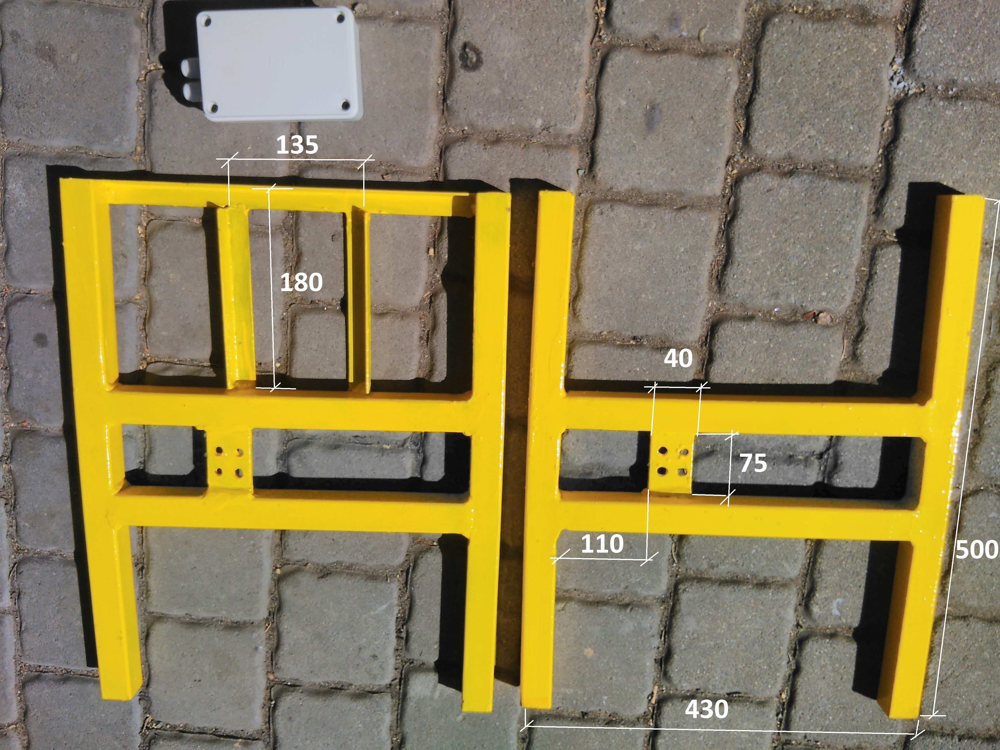
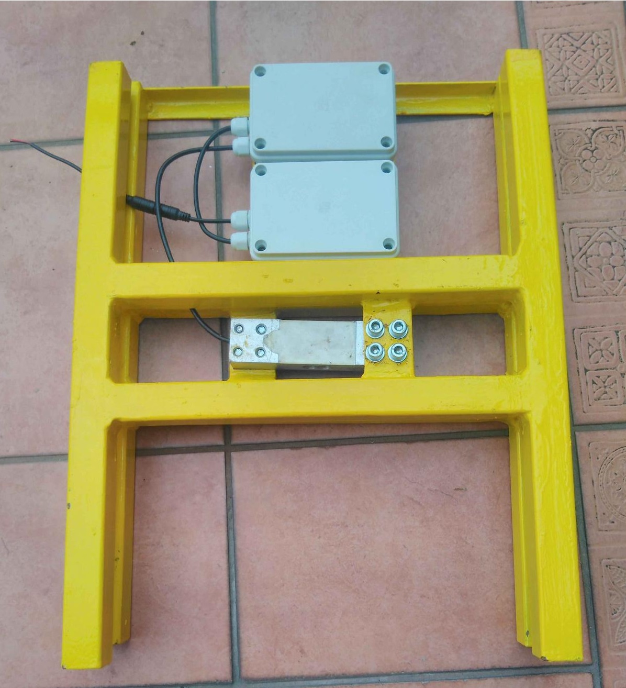
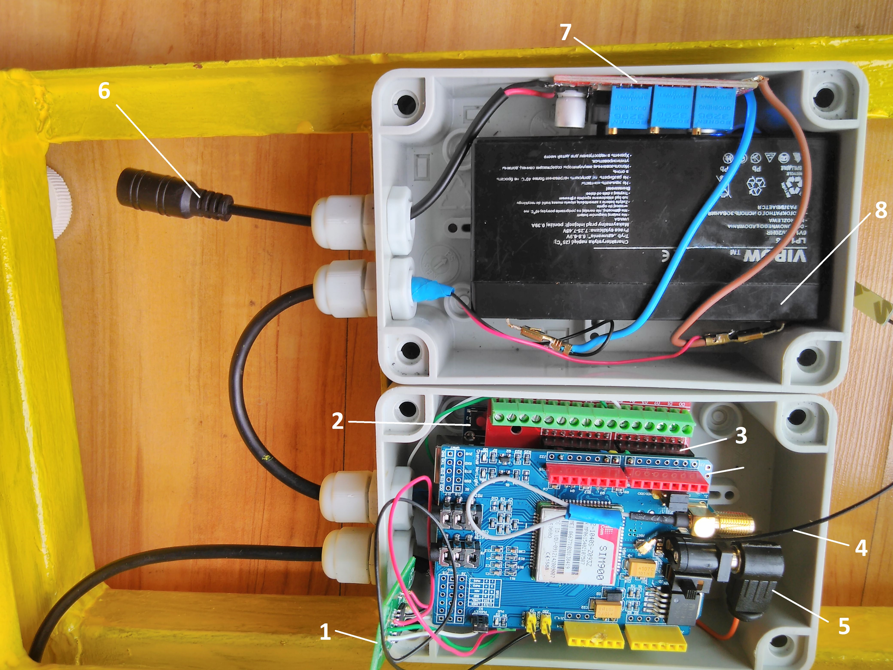
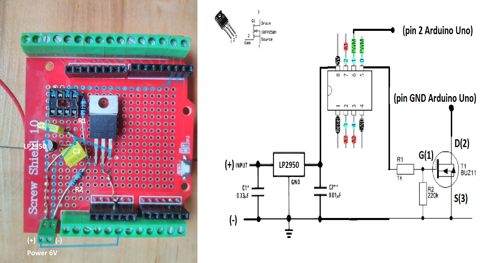
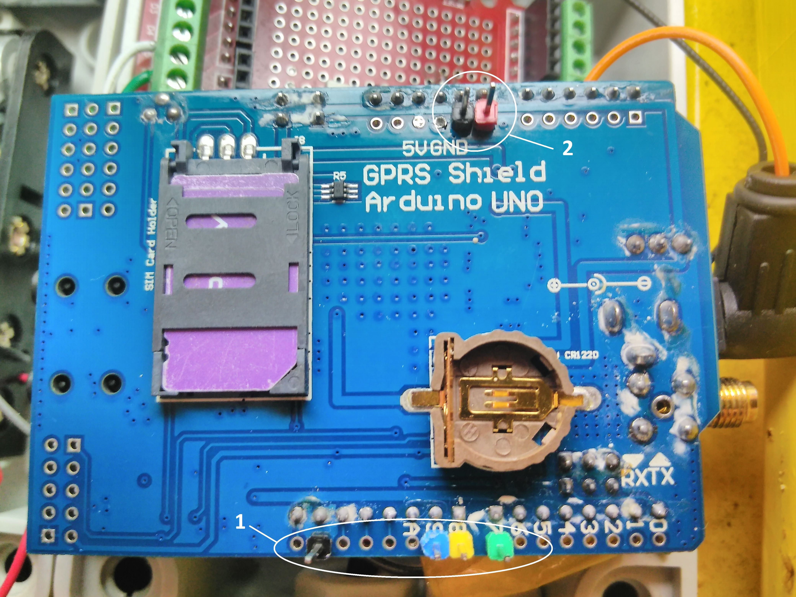

# Introduction

This version is a improved build of the my original bee scale, thanks to Piotr. 

He uses a 5V battery with solar charging in mind and separated the whole battery part from the Arduino and SIM Module for a more safety and cleaner build. 

Following is his build description. 

# Sample weight frame

It was made of a closed profile with a 30x30 mm square section. The weight sensor mounting place was made of a flat bar with a 4 mm diameter. The whole is welded with a MIG / MAG welder. In the lower part of the frame four M8 nuts are welded. Leveling feet are screwed into these nuts. The fastening of the hermetic boxes was made of a cold-bent angle 20x20x2 mm. There is a gap of about 15 mm between the weight segments. The gap is sufficient. The whole was painted with anti-corrosive paint. The frame dimensions have been chosen for the Dadant beehive type.

# View of the scale with mounted hermetic electric boxes
View of the scale with mounted hermetic electric boxes.
Two hermetic electrical boxes were mounted on the frame of the frame. You can use double-sided adhesive tape for this. One has an arduino, mounting plate, HX711 chip, SIM900 and internal antenna. The other has a 6V battery and a solar charging system. Cables enter the boxes through PG-7 glands.

Hermetic electric box, type: S-Box 216 - 120x80x50 - IP65

The weight sensor was attached to the frame with M8x35 mm Allen screws on washers.

# Arrangement of elements in electrical boxes

1. Board with HX-711 chip. Fastened to the side wall with double-sided adhesive tape.
2. Arduino Uno R3 board
3. Mounting plate - "Proto Screw Shield Assembled Prototype Terminal Expansion Board Module For Arduino IO I / O UNO R3 MEGA2560 Double Side SMT Solder"
4. Internal antenna for SIM900 - "WIFI 2.4G 3dbi PCB Antenna IPX IPEX WLAN Laptop Bluetooth Zigbee Wireless Module SIM900"
5. SIM900 direct power supply - "2.1mm x 5.5mm Male Plug Right Angle L Jack DC Power Connector"
6. input for power supply from solar panel - "5.5x2.1mm Plug DC male or Female Cable Wire Connector"
7. battery voltage regulator - "LM2596S DC-DC LM2577S Step Up Down Boost Buck Voltage Power Converter Module Non-isolated Constant Current Board 15W 3A"
8. AGM gel battery:
* Voltage: 6V
* Capacity: 1.3Ah
* Height - 51mm
* Length - 96mm
* Width - 24mm

# Screw Shield

# SIM900 plate - extra pins

1, 2 - Pins that need to be soldered to the SIM900 board

